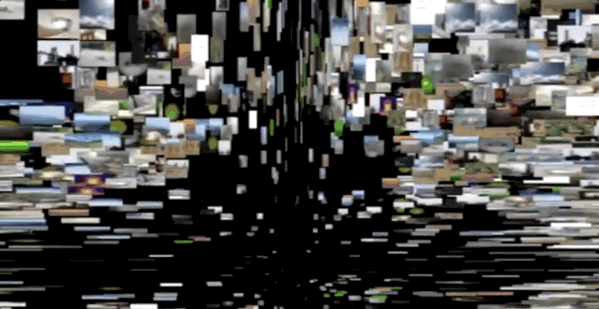
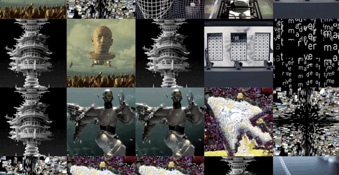
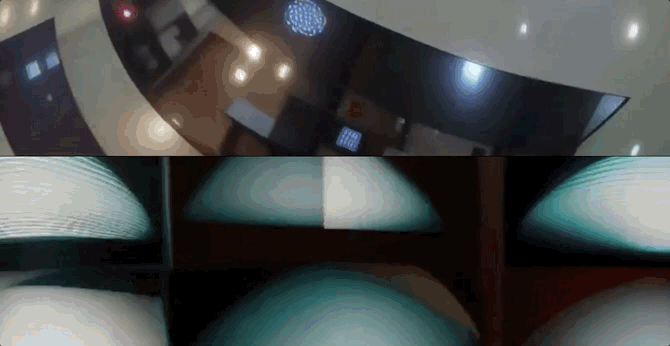
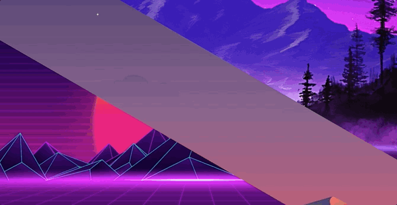

# Unity-ImageVideoScripts
A collection of Unity scripts for dynamic image and video playback, focusing on interactive and generative visuals.

---

### 🖼️ `Slide Images`
**Sequential and Random Image Playback**


Displays images from a Resources folder in either **sequential order** or randomized, creating a dynamic and ever-changing scene.

```csharp
// Key Features:
- Load images from a user-specified Resources folder
- Display them one after the other or randomize the order
- Easily customizable via the Inspector
```

---

### 🎲 `Grid Images`
**Dynamic Grid of Random Images**


Creates a **5×5 grid** of planes, each displaying a random image from a Resources folder. Images update frequently, creating a lively, mosaic-like visual.

```csharp
// Key Features:
- Uses a plane prefab for easy setup
- Dynamically populates the grid with images
- Changes textures at short intervals for a flickering, energetic effect
```

---

### 🎥 `Grid Videos (16:9)`
**Adaptive Video Grid**


Generates a **dynamic grid** of video clips that adapts to different aspect ratios. Videos are pulled from a Resources folder and played in grid cells that automatically fill the canvas.

```csharp
// Key Features:
- Dynamically resizes grid based on random grid sizes
- Preserves video aspect ratios for clean visuals
- Smoothly transitions between grid configurations
```

---

### 🌄 `Image Splitter`
**Randomized Image Splitter with Shader Control**


Splits a region into sections, assigning each section a random image from a folder. Uses Perlin noise to animate rotation for a smooth, organic feel.

```csharp
// Key Features:
- Shader-driven dynamic image splitting
- Loads images from a configurable Resources folder
- Randomizes and animates image sections for a unique aesthetic
```

---

## Contributing
These scripts are for educational and creative experimentation. Feel free to fork, adapt, and use them in your own generative art or interactive projects!

---

## Licensing
This work is dedicated to the public domain under the **Creative Commons CC0 1.0 Universal (CC0 1.0)** license.

**You are free to:**
- **Share** — copy and redistribute the material in any medium or format  
- **Adapt** — remix, transform, and build upon the material for any purpose, even commercially.

**No conditions.** You do not need to give credit or seek permission.

For details, see: [CC0 1.0 Universal](https://creativecommons.org/publicdomain/zero/1.0/)