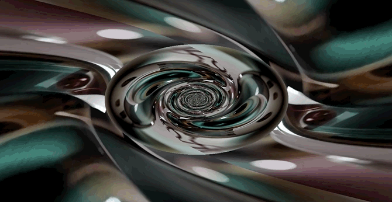
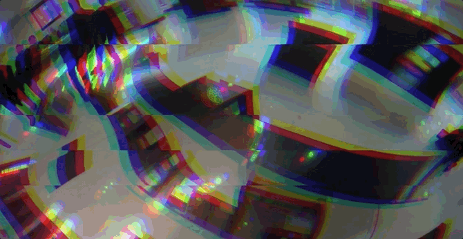

# Unity-ImageVideoScripts

A collection of Unity scripts and shaders for dynamic image, video, and generative visual effects. This repository focuses on interactive media, real-time visuals, and artistic experiments.

---

### 🖼️ `Slide Images`


**Sequential and Random Image Playback:** Displays images from the Resources folder in either **sequential order** or **random"", creating an ever-changing content.

```csharp
// Key Features:
- Load images from the Resources folder
- Display the images sequantially or randomly
- Customize content via the Inspector
```

---

### 🎲 `Grid Images`


**Dynamic Grid of Random Images:** Creates a **5×5 grid** of planes, each displaying a random image from a Resources folder. Images update frequently, creating a mosaic-like visual.

```csharp
// Key Features:
- Uses a plane prefab for setup
- Dynamically populates the grid with images
- Changes textures at short intervals with a flickering effect
```

---

### 🎥 `Grid Videos (16:9)`


**Adaptive Video Grid:** Generates a **dynamic grid** of video clips that adapts to different aspect ratios. Videos are pulled from the Resources folder and played in the grid cells that automatically fill the canvas.

```csharp
// Key Features:
- Dynamically resizes grid based on random sizes
- Preserves video aspect ratios for a clean visual effect
- Smoothly transitions between grid configurations
```

---

### 🌄 `Image Splitter`


**Randomized Image Splitter with Shader Control:** Splits a region into sections, assigning each section a random image from a folder. Uses Perlin noise to animate rotation for a smooth, organic feel.

```csharp
// Key Features:
- Shader-driven dynamic image splitting
- Loads images from a configurable Resources folder
- Randomizes and animates image sections for a unique aesthetic
```

---

### 🌀 `Tunnel`



**Twisting Tunnel Video Effect Shader:** A **real-time shader** that maps a video texture onto a twisting tunnel effect. The tunnel moves forward and rotates over time for a continuous flow.

```glsl
// Shader Features:
- Video texture mapped as a twisting tunnel
- Adjustable tunnel size, speed, and twist frequency
- Dynamic animation for captivating visuals
```

---

### ⚡ `Glitch Randomizer`



**Glitchy Chromatic Aberration and Stripes Shader:** A dynamic glitch shader that **randomly applies** chromatic aberration, wavy displacement, and alternating stripes to create intense glitchy visuals.

```glsl
// Shader Features:
- Chromatic aberration with adjustable displacement
- Animated wavy distortions and stripe glitches
- Randomized patterns for a constantly evolving glitch aesthetic
```

---

## Contributing
These scripts and shaders are shared for educational and creative experimentation. Feel free to **fork**, **adapt**, and integrate them into your own generative art or interactive projects.

---

## Licensing
This work is dedicated to the public domain under the **Creative Commons CC0 1.0 Universal (CC0 1.0)** license.

**You are free to:**
- **Share** — copy and redistribute the material in any medium or format  
- **Adapt** — remix, transform, and build upon the material for any purpose, even commercially.

**No conditions.** You do not need to give credit or seek permission.

For details, see: [CC0 1.0 Universal](https://creativecommons.org/publicdomain/zero/1.0/)